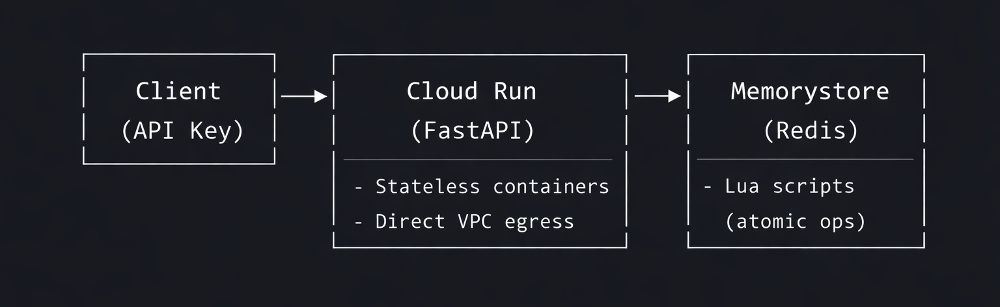

# Distributed Rate Limiting Service

A cloud-deployed distributed rate limiting backend service built with **FastAPI** and **Redis**.  
Enforces API request quotas using a **sliding window algorithm** - stateless, horizontally scalable, and cloud-native.


---

## 🎯 Problem Statement

In large-scale backend systems, APIs must be protected from abuse, accidental overuse, and denial-of-service scenarios.  
This service provides **centralized, distributed rate limiting** that can be shared across multiple API instances.

---

## 🏗️ Architecture



**Key Design Decisions:**
- **Sliding Window Algorithm** - Precise request counting, avoids fixed-window burst issues at window boundaries
- **Atomic Lua Scripts** - Race-condition-free Redis operations in a single round-trip, preventing double-counting
- **Stateless API** - Horizontally scalable, Redis handles all coordination
- **Direct VPC Egress** - Low-latency, private-IP communication between Cloud Run and Memorystore

---

## 🔧 Engineering Highlights

| Aspect | Implementation |
|--------|----------------|
| **Distributed State** | Redis (Memorystore) as centralized state store ensures rate-limiting consistency across horizontally scaled container instances |
| **Atomic Operations** | Lua scripting ensures atomicity and prevents race conditions during high-concurrency request spikes |
| **Cloud-Native Networking** | Direct VPC Egress for private-IP communication (~15ms latency reduction vs VPC Connectors) |
| **Sliding Window** | Prevents "burst at window edge" attacks - requests expire individually, not at fixed intervals |

---

## 📁 Project Structure

```
├── app/
│   ├── main.py           # FastAPI app + rate limit middleware
│   ├── rate_limiter.py   # Sliding window implementation (Lua script)
│   └── analytics.py      # Request/violation logging
├── docker-compose.yml    # Local dev stack (API + Redis)
├── Dockerfile
├── requirements.txt
└── redis.conf
```

---

## 🚀 Quick Start

### Local Development

```bash
# Clone and run
git clone https://github.com/cyb3rcr4t0712/distributed-rate-limiter
cd distributed-rate-limiter
docker-compose up --build

# Health check
curl http://localhost:8000/health

# Test rate limiting (100 req/min limit)
for i in {1..110}; do \
  curl -s -o /dev/null -w "%{http_code}\n" \
  -X POST -H "X-API-Key: test" \
  http://localhost:8000/api/resource; \
done
# First 100 return 200, then 429s kick in
```

---

## 📡 API Reference

| Method | Endpoint | Description |
|--------|----------|-------------|
| `GET` | `/health` | Health check (bypasses rate limit) |
| `GET` | `/` | Root endpoint (rate limited) |
| `POST` | `/api/resource` | Protected resource |

**Response Headers:**
```
X-RateLimit-Limit: 100
X-RateLimit-Remaining: 42
```

**Rate Limited Response (HTTP 429):**
```json
{"detail": "Too many requests. Please retry later."}
```

---

## 🎬 Live Verification & Demo

### Demo Recording


The demo above shows hitting the API endpoint repeatedly until `HTTP 429 Too Many Requests` kicks in.

### Terminal Verification

Verify the sliding window counter and rate limiting in action:

```bash
# Blast 110 requests in parallel - watch it count down then block
seq 1 110 | xargs -P 50 -I {} curl -s -D - -o /dev/null https://your-service-url.run.app | grep -iE "HTTP|x-ratelimit"

# Expected output:
# HTTP/1.1 200 OK
# x-ratelimit-remaining: 99
# x-ratelimit-remaining: 98
# ... counting down ...
# x-ratelimit-remaining: 1
# x-ratelimit-remaining: 0
# HTTP/1.1 429 Too Many Requests
# HTTP/1.1 429 Too Many Requests
```

The sliding window algorithm ensures requests expire individually - no "burst at window edge" issues common with fixed-window counters.

---

## ⚙️ Configuration

| Variable | Default | Description |
|----------|---------|-------------|
| `REDIS_URL` | `redis://localhost:6379` | Redis connection string |
| `DEFAULT_LIMIT` | `100` | Requests per window |
| `DEFAULT_WINDOW` | `60000` | Window size (ms) |

---

## ☁️ Cloud Deployment (GCP)

Deployed on **Google Cloud Run** with **GCP Memorystore (Redis)** using **Direct VPC Egress**.

### Prerequisites
- GCP Project with billing enabled
- Memorystore Redis instance in a VPC
- Artifact Registry repository

### Build & Deploy

```bash
# Build & push to Artifact Registry
gcloud builds submit \
  --tag us-central1-docker.pkg.dev/PROJECT_ID/rate-limiter-repo/rate-limiter:latest .

# Deploy to Cloud Run with Direct VPC Egress
gcloud run deploy rate-limiter-api \
  --image=us-central1-docker.pkg.dev/PROJECT_ID/rate-limiter-repo/rate-limiter:latest \
  --platform=managed \
  --region=us-central1 \
  --allow-unauthenticated \
  --network=default \
  --subnet=default \
  --vpc-egress=all-traffic \
  --port=8000 \
  --set-env-vars="REDIS_URL=redis://:PASSWORD@REDIS_PRIVATE_IP:6379" \
  --cpu-boost
```

### Why Direct VPC Egress?

| Feature | VPC Connector | Direct VPC Egress |
|---------|---------------|-------------------|
| Latency | ~25ms | ~10ms |
| Cost | Idle VM charges | Pay-per-use |
| Capacity | Regional limits (Code 13 errors) | No capacity issues |
| Setup | Requires connector resource | Native Cloud Run feature |

---

## 🛠️ Troubleshooting

### Common Issues Encountered & Solved

| Issue | Cause | Solution |
|-------|-------|----------|
| **Cloud Run health check failing** | Port mismatch (Uvicorn: 8000, Cloud Run default: 8080) | Add `--port=8000` to deploy command |
| **VPC Connector "Code 13" errors** | Regional capacity exhaustion | Switch to Direct VPC Egress (`--vpc-egress=all-traffic`) |
| **Redis connection timeout** | Cloud Run can't reach private IP | Enable Direct VPC Egress with `--network` and `--subnet` flags |
| **IAM permission errors** | Missing Compute Network User role | Grant role to Cloud Run service agent |

### Debugging Commands

```bash
# Check Cloud Run logs
gcloud logging read "resource.type=cloud_run_revision" --limit=50

# Verify Redis connectivity (from Cloud Shell with VPC access)
redis-cli -h REDIS_PRIVATE_IP -a PASSWORD ping

# Test rate limiter headers
curl -i https://your-service-url.run.app
```

---

## 📈 Future Improvements

- [ ] Per-client configurable rate limits (API key tiers)
- [ ] Prometheus metrics export (`/metrics` endpoint)
- [ ] Admin dashboard for real-time monitoring
- [ ] Global rate limiting across regions (Redis Cluster)
- [ ] Retry-After header with precise reset time

---

## 📄 License

MIT License © 2026 Shreyash
